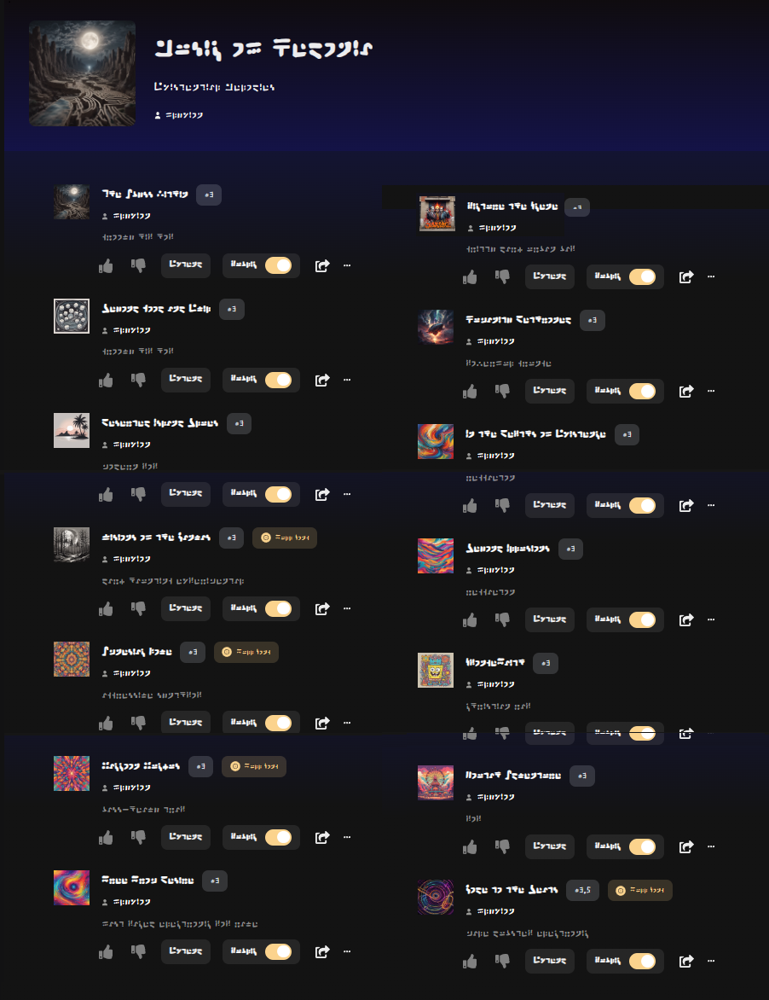

#   

  

## A Minimal Set of Rules for Learning Cistercian Numbers

## Dactyl

Digital Analog Clock   

  

Standard Galactic Alphabet  
[Live Demo](https://standardgalactic.github.io/) (Press the "z" key to toggle SGA font)

Try the [Galactic Translator](https://standardgalactic.github.io/sga-converter.html)

Also available [as an android app](https://github.com/standardgalactic/standardgalactic.github.io/blob/main/Galactic-Translator.apk)

  

Personal Biography

  

All-Caps

  

Unicode

  

# Youtronium Apocalypse

Part One (𝘈 𝘴𝘱𝘰𝘰𝘯𝘧𝘶𝘭 𝘰𝘧 𝘴𝘶𝘨𝘢𝘳)

[𝘔𝘶𝘴𝘪𝘤 𝘰𝘧 𝘏𝘦𝘥𝘰𝘯𝘪𝘢](https://suno.com/playlist/98e38102-8927-4dba-ba5b-2db0127c36ec)

Part Two (𝘛𝘢𝘬𝘦 𝘸𝘪𝘵𝘩 𝘢 𝘨𝘳𝘢𝘪𝘯 𝘰𝘧 𝘴𝘢𝘭𝘵)

  
  
  
  
  
  
  

