#   

<!--      -->
<p align="left">
  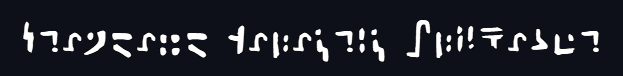
</p>

# How to Use Stylus Extension with Custom Font and Better YouTube Subtitles

## Using the Stylus Extension for Custom Fonts

The Stylus extension allows you to apply custom CSS styles to any website you visit. Follow these steps to use the Stylus extension with the provided custom font script:

### Step 1: Install the Stylus Extension

1. Go to the [Stylus extension page](https://add0n.com/stylus.html).
2. Click on the link to install Stylus for your browser (Chrome, Firefox, etc.).
3. Follow the prompts to add the Stylus extension to your browser.

### Step 2: Create a New Style

1. Click on the Stylus icon in your browser's toolbar.
2. Click on "Manage" to open the Stylus dashboard.
3. Click on "Write new style" or the "+" button to create a new style.
4. Give your style a name, e.g., "Custom Font Style".

### Step 3: Add the Custom Font Script

1. Copy the following CSS script:
    ```css
    /* Apply your custom font globally */
    * {
        font-family: 'SGA Regular' !important;
    }

    /* Specific styling for web page titles (usually h1 tags) */
    h1, .title, .heading {
        font-family: 'SGA Regular' !important;
    }

    /* Specific styling for page subtitles (usually h2 tags) */
    h2, .subtitle {
        font-family: 'SGA Regular' !important;
    }

    /* Apply custom font to links */
    a {
        font-family: 'SGA Regular' !important;
    }

    /* Apply custom font to navigation menus */
    nav, .navbar, .menu {
        font-family: 'SGA Regular' !important;
    }

    /* Apply custom font to buttons */
    button, .btn {
        font-family: 'SGA Regular' !important;
    }

    /* Apply custom font to form elements */
    input, textarea, select {
        font-family: 'SGA Regular' !important;
    }

    /* Additional elements that might need custom styling */
    p, span, div, li {
        font-family: 'SGA Regular' !important;
    }

    /* Attempt to style browser-specific elements (experimental) */
    .titlebar, .tab-title {
        font-family: 'SGA Regular' !important;
    }
    ```

2. Paste the script into the Stylus editor.
3. Click "Save" to save your new style.

### Step 4: Apply the Style

1. Navigate to any website where you want to apply the custom font.
2. Click on the Stylus icon in your toolbar.
3. Enable the custom style you created by clicking the checkbox next to its name.

Your custom font should now be applied to the website.

## Configuring Better YouTube Subtitles

Better YouTube Subtitles allows you to customize the appearance of subtitles on YouTube videos. Follow these steps to configure the extension with the provided settings:

### Step 1: Install Better YouTube Subtitles

1. Go to the [Better YouTube Subtitles extension page](https://chromewebstore.google.com/detail/better-youtube-subtitles/ponocngkmjmakpleolejgelipolkmalm).
2. Click "Add to Chrome" (or your respective browser) to install the extension.

### Step 2: Open the Extension Settings

1. Click on the Better YouTube Subtitles icon in your browser's toolbar.
2. Click on "Options" to open the settings page.

### Step 3: Configure Font Options

1. Set the "Font name" to `Sga`.
2. Set the "Font size" to `95%`.
3. Set the "Font weight" as desired.
4. Set the "Font color" as desired.
5. Set the "Font opacity" as desired.

### Step 4: Configure Text Options

1. Set "Letter spacing" to `0.03x`.
2. Set "Word spacing" to `0.04x`.
3. Set the "Line height" as desired.
4. Set "Text position (vertical)" to `Bottom`.
5. Set "Text position (horizontal)" to `Center`.
6. Set "Vertical text margin from edge" as desired.
7. Set "Horizontal text margin from edge" as desired.
8. Set "Text transform" to `None`.
9. Set "Text stroke" as desired.
10. Set "Text shadow" options:
    - Horizontal offset: `0.04x`
    - Vertical offset: `0.04x`
    - Blur radius: `0.05x`
    - Color and opacity as desired.

### Step 5: Configure Background Options

1. Set "Background type" to `Per line`.
2. Set "Background color and opacity" options:
    - Background color as desired.
    - Background opacity: `50%`.
3. Set "Background padding" as desired.
4. Set "Background radius" as desired.

Your customized subtitle settings should now be applied to YouTube videos.

By following these steps, you can use the Stylus extension to apply custom fonts globally and configure Better YouTube Subtitles for an improved viewing experience.
## Arabic Phonetic English

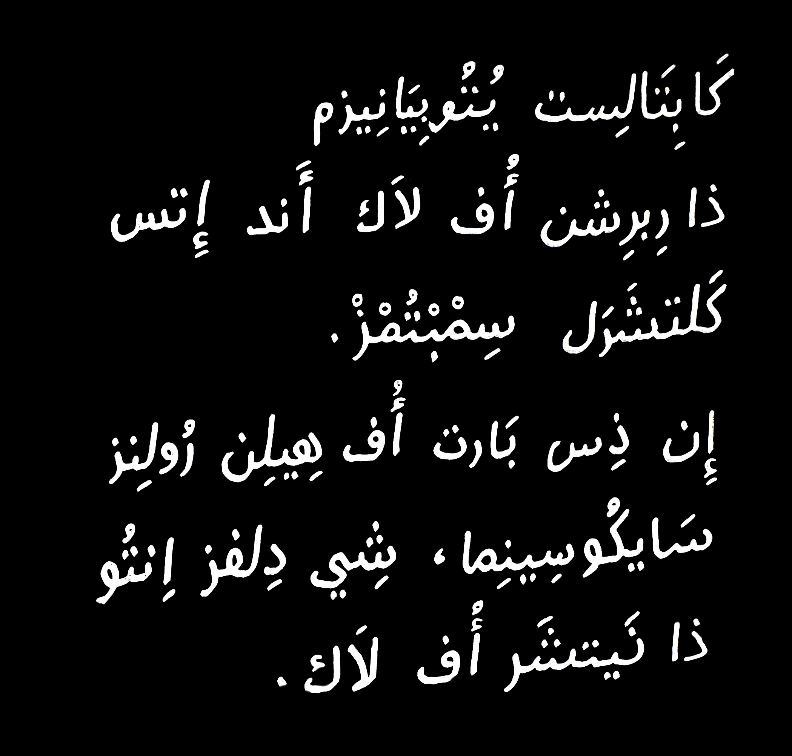

## A New Arabic Keyboard

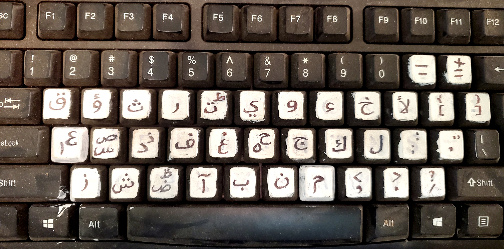

[The Anak keyboard uses the upper case for the pharyngealized and emphatic letters.](https://github.com/standardgalactic/alphabet/blob/core/tosga.ahk)


## Dvorak

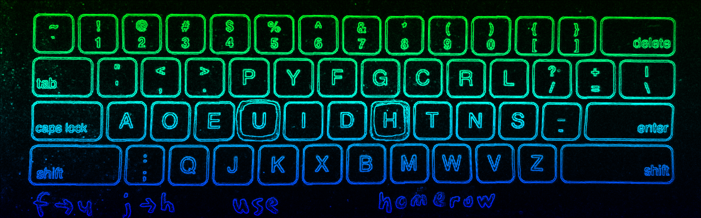

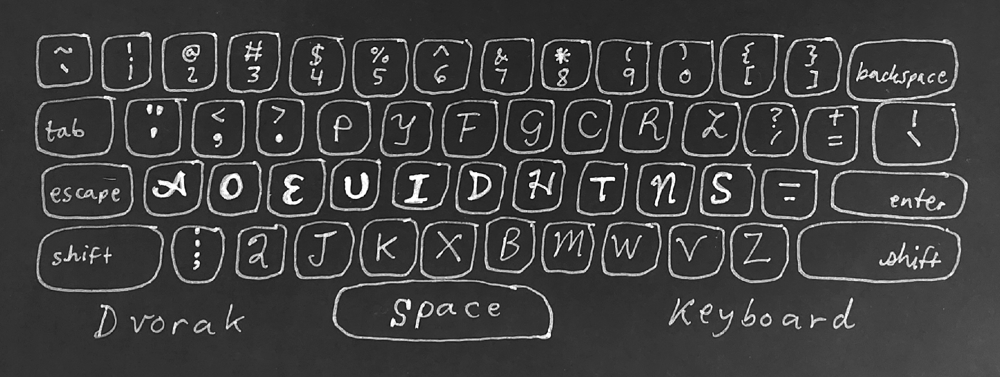

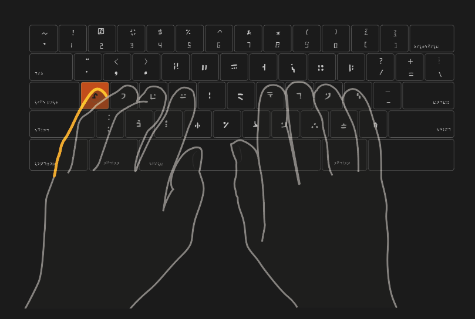

## A Minimal Set of Rules for Learning Cistercian Numbers


## Dactyl

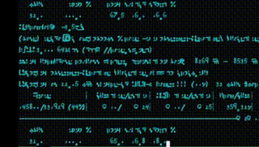

Digital Analog Clock  <br>

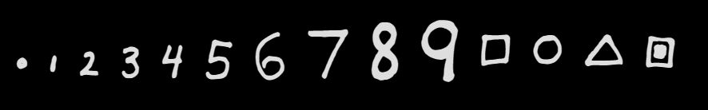

<p align="left">
  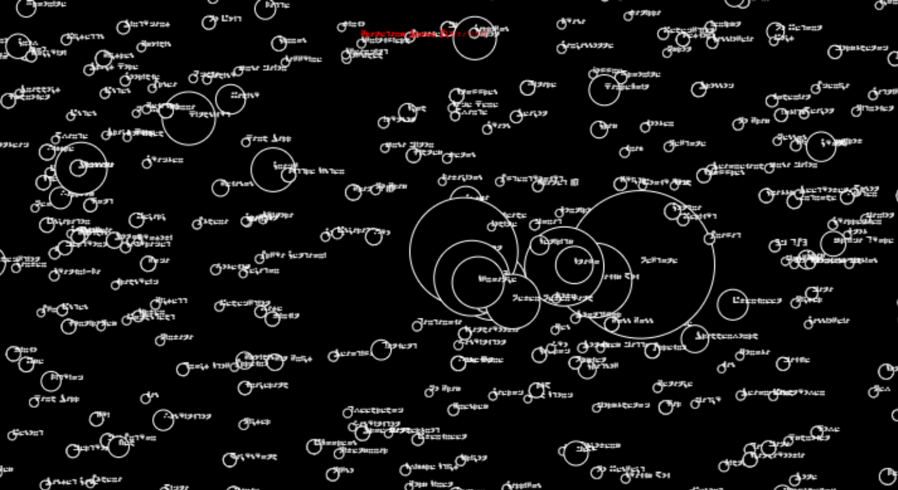
</p>

Standard Galactic Alphabet <br>
[Live Demo](https://standardgalactic.github.io/) (Press the "z" key to toggle SGA font)

Try the [Galactic Translator](https://standardgalactic.github.io/sga-converter.html)

<p align="center">
  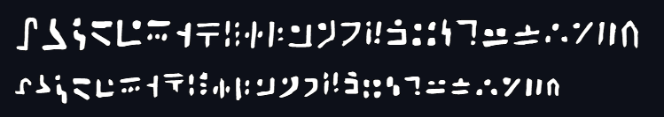
</p>

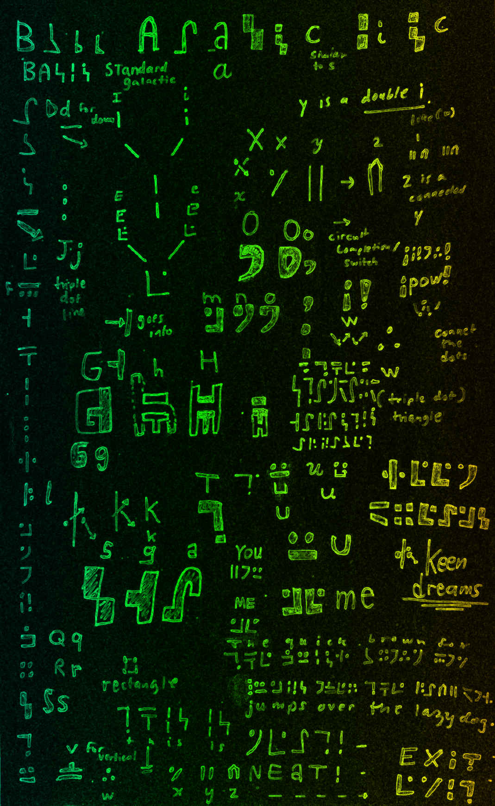

Personal Biography
<p align="center">
  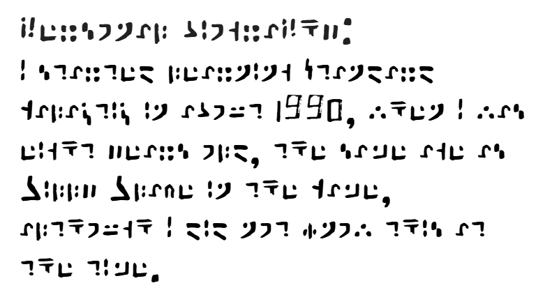
</p>

All-Caps
<p align="left">
  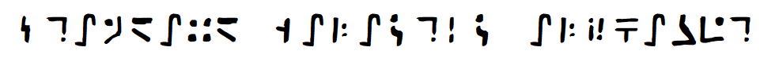
</p>

Unicode
<p align="left">
  
</p>

# Other Ciphers

## Logico Philosophicus

[Cryptographic Puzzle](https://standardgalactic.github.io/alphabet/cipher.html)

## Aurebesh

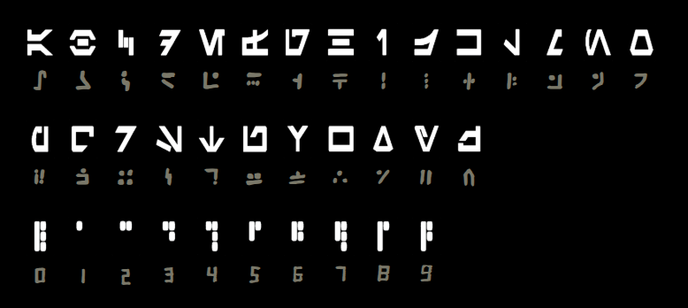

## Klingon

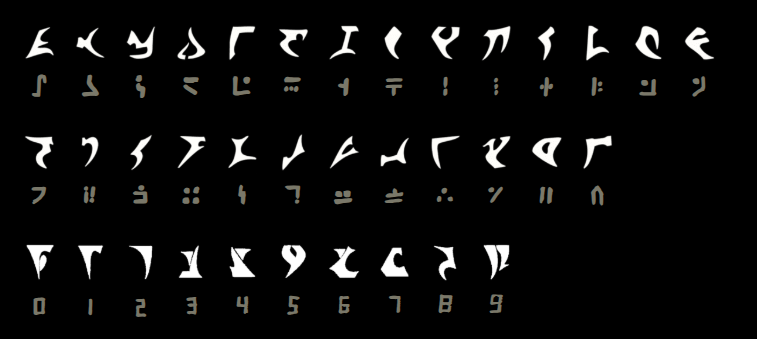


# How to Use

Install SGA-Regular.ttf 

# To use as System language in Windows

!! Very Dangerous !!
!! Do not use unless you know what you are doing !!

Run vorticon.reg to set SGA-Regular as system language,
and vorticon-restore.reg to return it to normal.

May need to restart Windows for it to take effect.


This page is live at https://standardgalactic.github.io/alphabet
