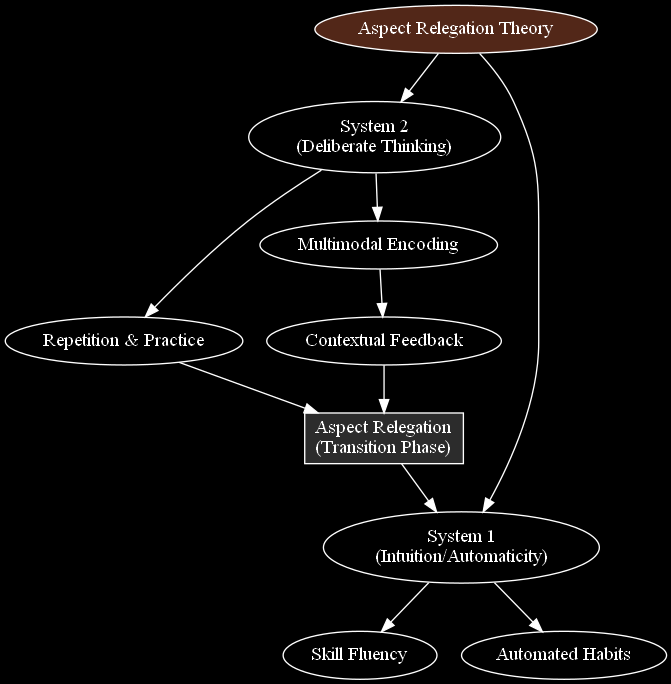

#   

# Standard Galactic Alphabet

  

This repository began as a collection of fonts, keyboards, translators, ciphers, and visual experiments surrounding the Standard Galactic Alphabet. It has since expanded into a long-running art and research project about technological fashion, speculative systems, interface culture, technical rhetoric, and the ways experimental ideas become products, doctrines, or abandoned futures.

It is not a single-purpose software package. It is an accretive studio and public archive containing essays, research notes, software experiments, visual works, recordings, source material, demonstrations, and unfinished investigations. Some projects remain active here; others are complete, historical, or continued in separate repositories.

## Start here

- [Constraint and Displacement](Analysis/README.md)
- [Research](research/)
- [Frameworks](framework/)
- [Essays](essay/)
- [Manuscripts](manuscripts/)
- [Monographs](monograph/)
- [Experiments](experiments/)
- [Projects](projects/)
- [Sources and reference material](sources/)
- [Roadmap](roadmap/)

These categories overlap because the repository records the development of the work rather than presenting a retrospectively tidy taxonomy.

## Live work

- [Standard Galactic Alphabet site](https://standardgalactic.github.io/alphabet/)
- [Galactic Translator](https://standardgalactic.github.io/sga-converter.html)
- [Cryptographic Puzzle](https://standardgalactic.github.io/alphabet/cipher.html)
- [Dactyl](dactyl/)
- [Cistercian numbers](cistercian/)

The live alphabet demonstration can be toggled between Latin and SGA with the `z` key.

## Origins

The repository's earliest layer includes the Standard Galactic Alphabet font, Unicode and all-caps experiments, Arabic phonetic English, the Anak and Dvorak keyboards, Logico Philosophicus, Cistercian numbers, Dactyl, and a collection of visual demonstrations. These materials remain part of the project, but they no longer describe its entire scope.

## Related repositories

Font development has been spun out into [standardgalactic/fonts](https://github.com/standardgalactic/fonts). Files retained here may be historical, experimental, or required by older demonstrations; the separate repository should be treated as the current home of the font work.

Other components may likewise acquire independent repositories as they become projects in their own right. Their presence here records their origin and conceptual relationship to the larger work.

## Repository status

Activity is uneven by design. A file or directory may be active, stable, complete, continuing, extracted, historical, fragmentary, superseded, or not yet classified. The modification date of this README should not be treated as the activity status of the repository as a whole.

This collection is being documented and reorganized incrementally. Existing paths are preserved where they support published pages, citations, or links from related repositories.

## Historical font installation

The older materials include `SGA-Regular.ttf` and Windows registry files that replace the system font. Those registry files affect the Windows interface globally and should be treated as historical experiments, not as a recommended installation method.

For current font work and installation guidance, use [standardgalactic/fonts](https://github.com/standardgalactic/fonts).

## License

See [LICENSE](LICENSE).
