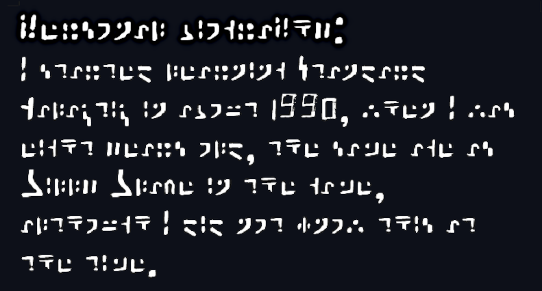

#   

  

## A Minimal Set of Rules for Learning Cistercian Numbers

## Dactyl

Digital Analog Clock   

  

Standard Galactic Alphabet  
[Live Demo](https://standardgalactic.github.io/) (Press the "z" key to toggle SGA font)

Try the [Galactic Translator](https://standardgalactic.github.io/sga-converter.html)

Also available [as an android app](https://github.com/standardgalactic/standardgalactic.github.io/blob/main/Galactic-Translator.apk)

  

Personal Biography

  

All-Caps

  

Unicode

  

See also:
[Commander Keen](https://en.m.wikipedia.org/wiki/Commander_Keen#Standard_Galactic_Alphabet)

  

## SGA Unicode

This page is live [here.](https://standardgalactic.github.io/alphabet)
