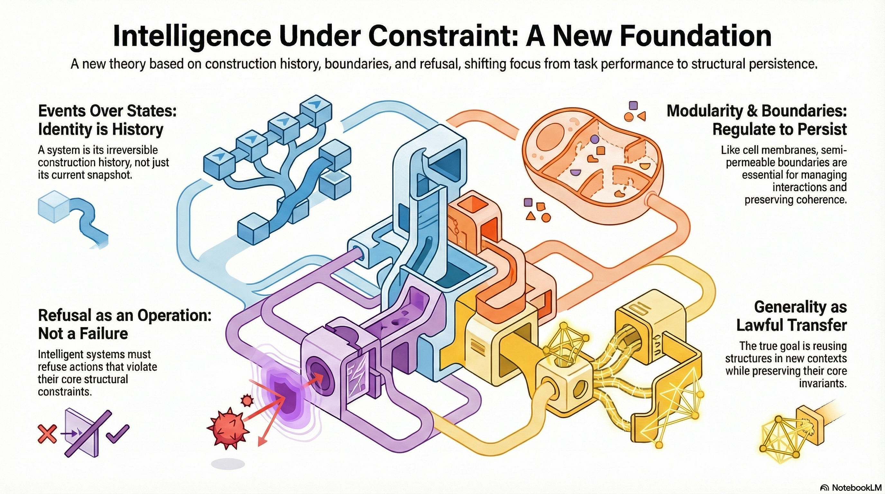

# Constraint-First Intelligence: Event, Structure, and Explanation

This repository collects a set of essays and formal documents developing a **constraint-first, event-based theory of intelligence, language, and explanation**.  
The core idea is that genuine understanding is grounded in **irreversible event histories, invariant preservation, and lawful refusal**, not in state-based representations or statistical prediction.

The documents are ordered from **conceptual introductions** to **formal foundations**.

---

## Conceptual Introductions

- [The Secret Rules of Language](The_Secret_Rules_of_Language.md)  
  Why grouping, commitment, and nonassociativity matter more than prediction in human language.

- [Four Radical Ideas That Will Change How You Think About Thinking](Four_Radical_Ideas_That_Will_Change_How_You_Think_About_Thinking.md)  
  A high-level reframing of memory, refusal, explanation, and the limits of modern AI.

---

## Core Theory and Synthesis

- [A Constraint-First Story of Intelligence](A_Constraint_First_Story_of_Intelligence.md)  
  An accessible narrative introduction to intelligence as construction under constraint.

- [Constraint-First Theory of Intelligence](Constraint_First_Theory_of_Intelligence.md)  
  A more formal articulation of event histories, counterfactual control, and architectural limits.

- [Constraint-First Framework: Synthesis](Constraint_First_Framework_Synthesis.md)  
  A unifying synthesis tying cognition, language, intelligence, and physics together.

- [Event-First Briefing Document](Event_First_Briefing_Document.md)  
  A structured overview of the full framework, suitable as a technical briefing.

- [Entropy, Abstraction, and Irreversible Constraint](Entropy_Abstraction_and_Irreversible_Constraint.md)  
  A compact statement linking abstraction, entropy, time, and irreversible structure.

---

## Formal Foundations

- [Formal Foundations of Spherepop Calculus](Formal_Foundations_of_Spherepop_Calculus.md)  
  A rigorous axiomatic and algebraic specification of the event-first computational substrate.

---

## How to Read

- Start with **The Secret Rules of Language** or **Four Radical Ideas** for intuition.
- Move through the **Constraint-First** essays for theoretical depth.
- End with **Formal Foundations of Spherepop Calculus** for full mathematical grounding.

---

## Core Claim (One Sentence)

**Explanation requires counterfactual control over invariant-preserving event histories; systems that discard history for state can predict, but cannot explain.**
