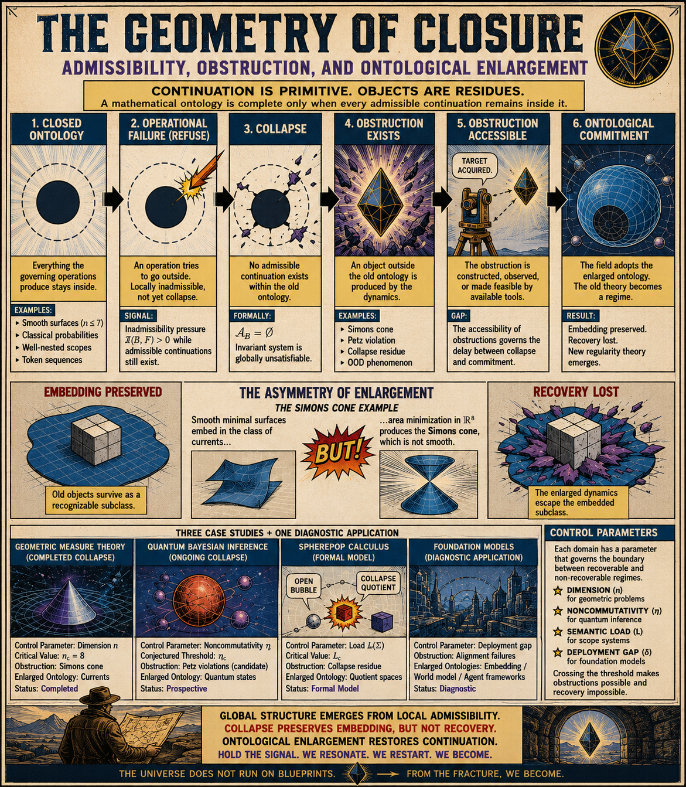

[The Geometry of Closure](https://standardgalactic.github.io/alphabet/processing/geometry_of_closure.pdf)

* [The Logic of Ontological Enlargement](https://standardgalactic.github.io/alphabet/processing/The_Logic_of_Ontological_Enlargement.pdf) — *Notes*

* [Graphic Novel](https://standardgalactic.github.io/alphabet/processing/geometry-of-closure-comic.pdf)

* [Why Mathematical Realities Outgrow Their Maps](https://standardgalactic.github.io/alphabet/processing/audio-visualizer.html) — *Audio Overview*

[Abstraction as Reduction](https://standardgalactic.github.io/alphabet/processing/Abstraction%20as%20Reduction.pdf)

* [Audio Overview](https://standardgalactic.github.io/alphabet/processing/)

