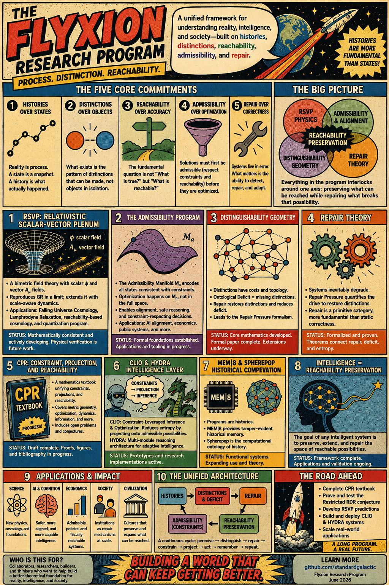

# Roadmap

[Collected Works](https://standardgalactic.github.io/alphabet/roadmap/collected-works.pdf) — *Research Program*

[Procedural Generation of Attention](https://standardgalactic.github.io/alphabet/roadmap/procedural-attention.pdf)

[States Without Histories](https://standardgalactic.github.io/alphabet/roadmap/states_without_histories.pdf)

[Representation Without Faithfulness](https://standardgalactic.github.io/alphabet/roadmap/representation-without-faithfulness.pdf)

* [The Geometry of Distinction](https://standardgalactic.github.io/alphabet/roadmap/The_Geometry_of_Distinction.pdf)

[Process, Distinction, and Reachability](https://standardgalactic.github.io/alphabet/roadmap/flyxion_briefing.pdf) — *Research Program*

* [The Physics of Meaning](https://standardgalactic.github.io/alphabet/roadmap/The_Physics_of_Meaning.pdf)

* [Research Briefing](https://standardgalactic.github.io/alphabet/roadmap/Research_Briefing.pdf)

[Audio Overviews](https://standardgalactic.github.io/alphabet/roadmap/)

