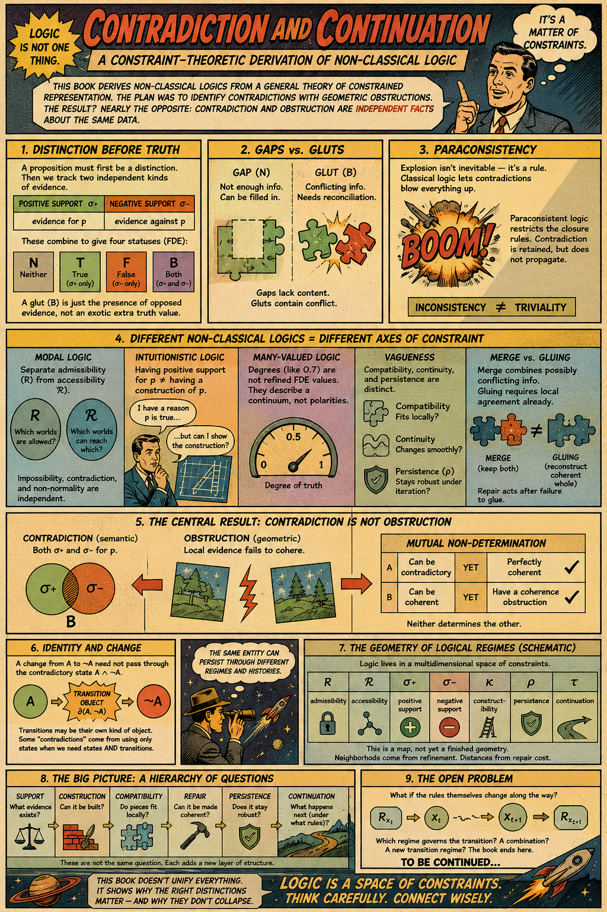

[Consistency Constraints and the Geometry of Learned Representations](https://standardgalactic.github.io/alphabet/soup/consistency-constraints.pdf)

This paper proposes the **Representational Constraint Hypothesis**: what matters in a foundational AI curriculum is not its language or modality, but the number of independent, partially corrupted views of a shared latent state that a model must reconcile. Generalizing David Eichler's Basque First proposal, it distinguishes symbolic explicitness from constraint diversity, argues that early constraints reshape representations while late ones encourage translation shortcuts, and proposes experiments comparing linguistic, signed, embodied, and synthetic curricula.

[Contradiction and Continuation](https://standardgalactic.github.io/alphabet/soup/contradiction-and-continuation.pdf)

This book develops Graham Priest's non-classical and dialetheic logics within a general theory of constrained representation, deriving four statuses—Neither, True, False, and Both—from independent positive and negative support. Its central result, the **Mutual Non-Determination Proposition**, shows that contradiction and geometric incoherence are independent: a representation may be contradictory yet coherent, or non-contradictory yet obstructed. It then situates several non-classical logics as distinct constraint regimes within a common geometric framework.

[Nothing Original Need Survive](https://standardgalactic.github.io/alphabet/soup/nothing-original.pdf)

Using Card's "The Originist," Zebrowski's *Macrolife*, and Le Guin's *The Dispossessed*, this essay argues that continuity belongs to histories rather than present states: identical states can have different provenance, while radically different states can belong to one continuous history. Through cases involving forgery, replacement, branching, and reconstruction, it develops a provenance-sensitive account of continuity and connects it to RSVP, TARTAN, Chain of Memory, and Spherepop.

